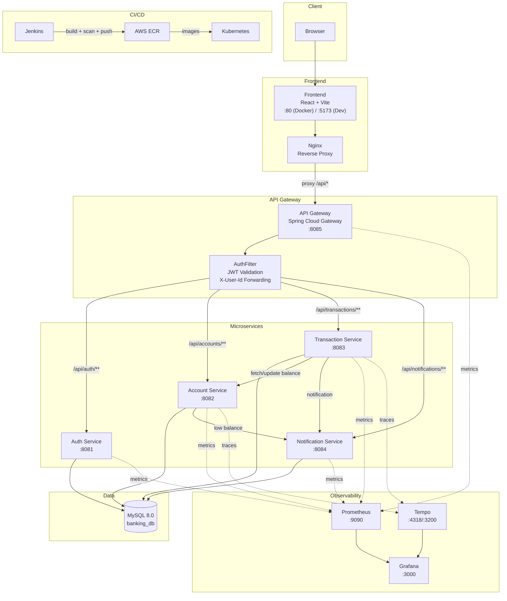
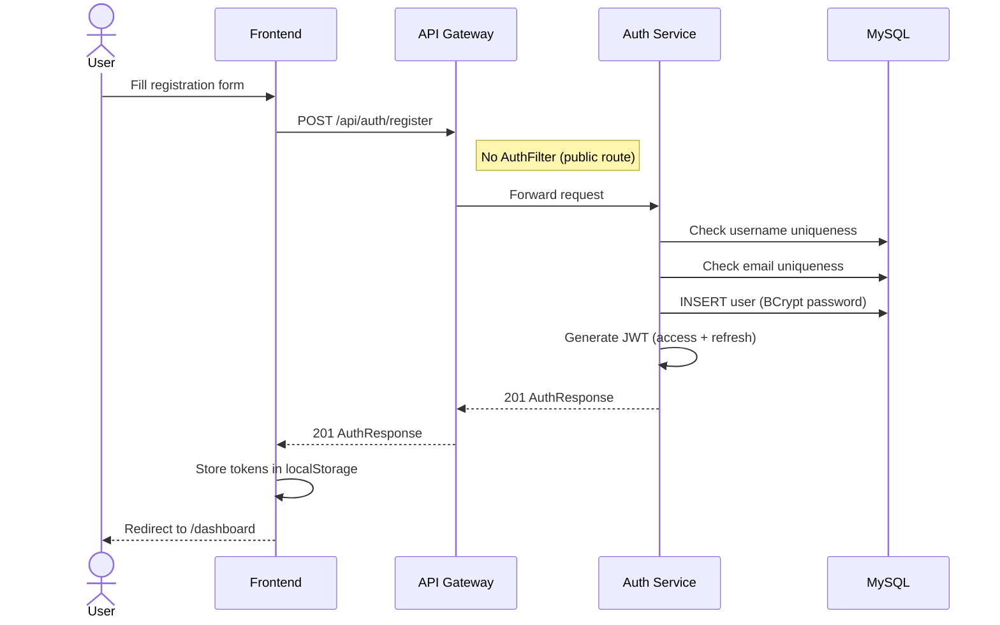
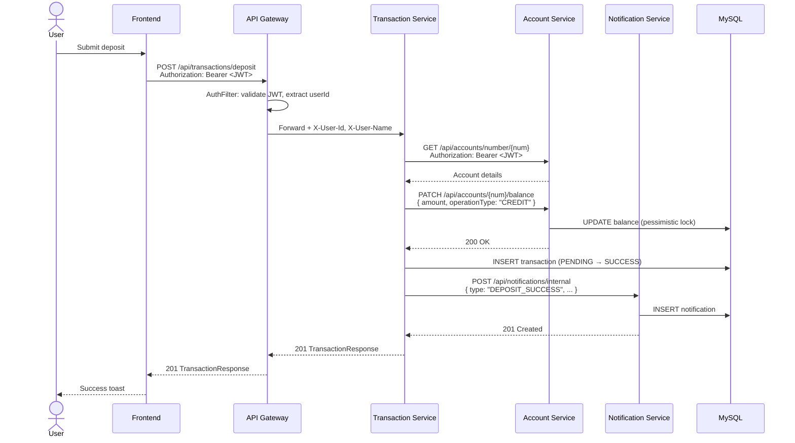
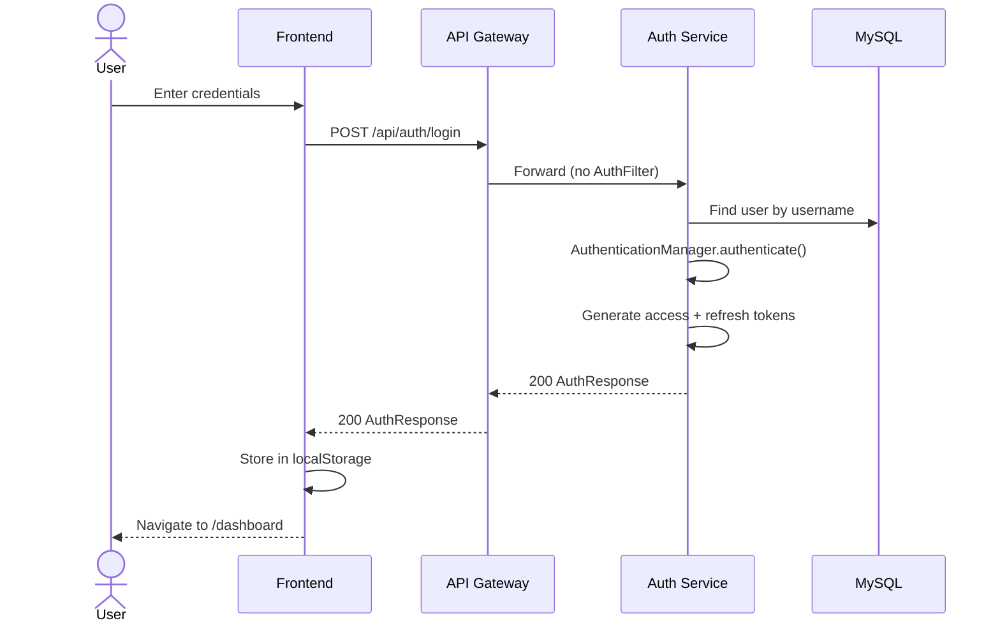
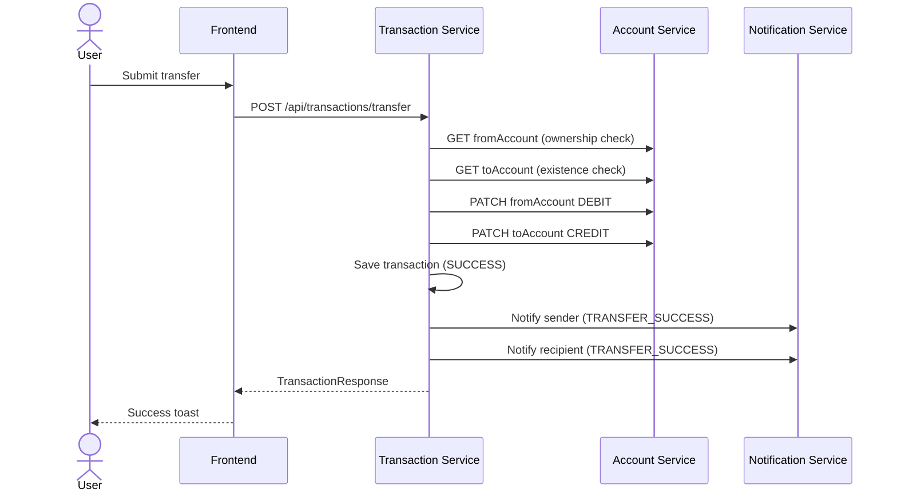

# Enterprise DevSecOps Observability Platform — Complete Project Map

## 1. Complete Project Folder Tree

```
enterprise-devsecops-observability-platform/
├── .gitignore
├── Jenkinsfile                          # Full CI/CD pipeline (422 lines)
├── README.md                            # Basic setup instructions
├── docker-compose.yml                   # Local orchestration (7 services)
│
├── auth-service/                        # Spring Boot — port 8081
│   ├── .dockerignore
│   ├── Dockerfile                       # Multi-stage: Maven build → JRE 21
│   ├── pom.xml
│   └── src/main/
│       ├── java/com/banking/auth/
│       │   ├── AuthServiceApplication.java
│       │   ├── config/SecurityConfig.java
│       │   ├── controller/AuthController.java
│       │   ├── dto/
│       │   │   ├── AuthResponse.java
│       │   │   ├── LoginRequest.java
│       │   │   ├── RefreshTokenRequest.java
│       │   │   ├── RegisterRequest.java
│       │   │   └── UserResponse.java
│       │   ├── exception/
│       │   │   ├── ApiException.java
│       │   │   ├── ConflictException.java
│       │   │   ├── GlobalExceptionHandler.java
│       │   │   ├── ResourceNotFoundException.java
│       │   │   └── UnauthorizedException.java
│       │   ├── model/User.java
│       │   ├── repository/UserRepository.java
│       │   ├── security/
│       │   │   ├── JwtAuthenticationFilter.java
│       │   │   ├── JwtService.java
│       │   │   └── UserDetailsServiceImpl.java
│       │   └── service/AuthService.java
│       └── resources/application.yml
│
├── account-service/                     # Spring Boot — port 8082
│   ├── .dockerignore
│   ├── Dockerfile
│   ├── pom.xml
│   └── src/main/
│       ├── java/com/banking/account/
│       │   ├── AccountServiceApplication.java
│       │   ├── config/SecurityConfig.java
│       │   ├── controller/AccountController.java
│       │   ├── dto/
│       │   │   ├── AccountResponse.java
│       │   │   ├── ApiResponse.java
│       │   │   ├── BalanceUpdateRequest.java
│       │   │   └── CreateAccountRequest.java
│       │   ├── exception/
│       │   │   ├── AccountNotFoundException.java
│       │   │   ├── GlobalExceptionHandler.java
│       │   │   ├── InactiveAccountException.java
│       │   │   └── InsufficientFundsException.java
│       │   ├── model/Account.java
│       │   ├── repository/AccountRepository.java
│       │   ├── security/
│       │   │   ├── JwtAuthenticationFilter.java
│       │   │   └── JwtService.java
│       │   └── service/AccountService.java
│       └── resources/application.yml
│
├── transaction-service/                 # Spring Boot — port 8083
│   ├── .dockerignore
│   ├── Dockerfile
│   ├── pom.xml
│   └── src/
│       ├── main/java/com/banking/transaction/
│       │   ├── TransactionServiceApplication.java
│       │   ├── config/
│       │   │   ├── RestTemplateConfig.java
│       │   │   └── SecurityConfig.java
│       │   ├── controller/TransactionController.java
│       │   ├── dto/
│       │   │   ├── ApiResponse.java
│       │   │   ├── TransactionRequest.java
│       │   │   └── TransactionResponse.java
│       │   ├── exception/
│       │   │   ├── GlobalExceptionHandler.java
│       │   │   └── TransactionException.java
│       │   ├── model/Transaction.java
│       │   ├── repository/TransactionRepository.java
│       │   ├── security/
│       │   │   ├── JwtAuthenticationFilter.java
│       │   │   ├── JwtContext.java
│       │   │   └── JwtService.java
│       │   └── service/TransactionService.java
│       ├── main/resources/application.yml
│       └── test/java/com/banking/transaction/dto/
│           └── TransactionRequestDeserializationTest.java
│
├── notification-service/                # Spring Boot — port 8084
│   ├── .dockerignore
│   ├── Dockerfile
│   ├── pom.xml
│   └── src/main/
│       ├── java/com/banking/notification/
│       │   ├── NotificationServiceApplication.java
│       │   ├── controller/NotificationController.java
│       │   ├── dto/
│       │   │   ├── ApiResponse.java
│       │   │   ├── NotificationRequest.java
│       │   │   └── NotificationResponse.java
│       │   ├── exception/
│       │   │   ├── ForbiddenException.java
│       │   │   ├── GlobalExceptionHandler.java
│       │   │   └── ResourceNotFoundException.java
│       │   ├── model/Notification.java
│       │   ├── repository/NotificationRepository.java
│       │   └── service/NotificationService.java
│       └── resources/application.yml
│
├── api-gateway/                         # Spring Cloud Gateway — port 8085
│   ├── .dockerignore
│   ├── Dockerfile
│   ├── pom.xml
│   └── src/main/
│       ├── java/com/banking/gateway/
│       │   ├── ApiGatewayApplication.java
│       │   ├── filter/AuthFilter.java
│       │   └── security/JwtService.java
│       └── resources/application.yml
│
├── frontend/                            # React + Vite + Tailwind
│   ├── .dockerignore
│   ├── Dockerfile                       # Multi-stage: Node build → nginx:1.27
│   ├── index.html
│   ├── nginx.conf
│   ├── package.json
│   ├── package-lock.json
│   ├── postcss.config.js
│   ├── tailwind.config.js
│   ├── vite.config.js
│   └── src/
│       ├── main.jsx
│       ├── App.jsx
│       ├── index.css
│       ├── contexts/AuthContext.jsx
│       ├── hooks/useAuth.js
│       ├── lib/
│       │   ├── api.js
│       │   └── axios.js
│       ├── components/
│       │   ├── EmptyState.jsx
│       │   ├── ErrorBoundary.jsx
│       │   ├── Layout.jsx
│       │   ├── Modal.jsx
│       │   ├── PageHeader.jsx
│       │   ├── Spinner.jsx
│       │   ├── StatCard.jsx
│       │   └── TransactionBadge.jsx
│       └── pages/
│           ├── AccountDetailPage.jsx
│           ├── AccountsPage.jsx
│           ├── DashboardPage.jsx
│           ├── LoginPage.jsx
│           ├── NotificationsPage.jsx
│           ├── RegisterPage.jsx
│           └── TransactionsPage.jsx
│
└── k8s/                                 # Kubernetes manifests (Kustomize)
    ├── README.md
    ├── kustomization.yaml
    ├── namespace.yaml
    ├── mysql-secret.yaml
    ├── mysql-statefulset.yaml
    ├── account-deployment.yaml
    ├── auth-deployment.yaml
    ├── transaction-deployment.yaml
    ├── notification-deployment.yaml
    ├── api-gateway-deployment.yaml
    ├── api-gateway-config.yaml
    ├── frontend-deployment.yaml
    ├── frontend-nginx-config.yaml
    └── observability.yaml               # Prometheus + Grafana + Tempo (663 lines)
```

---

## 2. Explain Every Folder and File

### Root Files

| File | Purpose |
|---|---|
| `Jenkinsfile` | Full CI/CD pipeline: checkout, secret scan, SAST, build, quality gate, dependency scan, Docker build, container scan, ECR push |
| `docker-compose.yml` | Local development orchestration for all 7 services (MySQL, 4 microservices, gateway, frontend) |
| `README.md` | Basic architecture diagram, service ports, and getting-started instructions |
| `.gitignore` | Ignores IDE files, build artifacts, node_modules, .env files |

### Backend Services (4 microservices + 1 gateway)

Each Spring Boot service follows the same internal structure:

```
service-name/
├── Dockerfile              # Multi-stage: maven:3.9.9-eclipse-temurin-21 → eclipse-temurin:21-jre-jammy
├── .dockerignore           # Excludes .git, target/, IDE files
├── pom.xml                 # Spring Boot 3.5.14, Java 21, pinned CVE versions
└── src/main/
    ├── java/com/banking/service-name/
    │   ├── *Application.java        # @SpringBootApplication entry point
    │   ├── config/                  # SecurityConfig, RestTemplateConfig
    │   ├── controller/              # REST controllers (@RestController)
    │   ├── dto/                     # Request/Response DTOs
    │   ├── exception/               # Custom exceptions + GlobalExceptionHandler
    │   ├── model/                   # JPA @Entity classes
    │   ├── repository/              # Spring Data JPA repositories
    │   ├── security/                # JWT service, authentication filter
    │   └── service/                 # Business logic
    └── resources/application.yml    # Spring Boot configuration
```

### Frontend

```
frontend/
├── Dockerfile              # Multi-stage: node:20-alpine (build) → nginx:1.27-alpine (serve)
├── nginx.conf              # Proxies /api/* to api-gateway:8085, serves React SPA
├── vite.config.js          # Dev server on :5173, proxies /api to localhost:8080
├── tailwind.config.js      # Custom "brand" color palette
├── src/
│   ├── main.jsx            # React entry: QueryClient, BrowserRouter, ErrorBoundary, Toaster
│   ├── App.jsx             # Route definitions with PrivateRoute/PublicRoute guards
│   ├── contexts/           # AuthContext — login/register/logout state
│   ├── hooks/              # useAuth() thin wrapper over useAuthContext()
│   ├── lib/
│   │   ├── axios.js        # Axios instance: JWT interceptor, 401 auto-redirect
│   │   └── api.js          # API functions (authApi, accountApi, etc.) + getErrorMessage()
│   ├── components/         # Reusable UI: Layout, Modal, Spinner, StatCard, etc.
│   └── pages/              # Page components: Dashboard, Accounts, Transactions, etc.
```

### Kubernetes

```
k8s/
├── kustomization.yaml              # Kustomize entry: all resources + ECR image tags
├── namespace.yaml                  # "banking" namespace
├── mysql-secret.yaml               # Secret: root password, user, user password (base64)
├── mysql-statefulset.yaml          # MySQL 8.0 StatefulSet with PVC (gp2, 10Gi)
├── auth-deployment.yaml            # Deployment + ClusterIP Service
├── account-deployment.yaml         # Deployment + ClusterIP Service
├── transaction-deployment.yaml     # Deployment + ClusterIP Service + env vars
├── notification-deployment.yaml    # Deployment + ClusterIP Service
├── api-gateway-deployment.yaml     # Deployment + ClusterIP Service + ConfigMap volume
├── api-gateway-config.yaml         # ConfigMap: full application.yml for gateway routes
├── frontend-deployment.yaml        # Deployment + LoadBalancer Service (port 80)
├── frontend-nginx-config.yaml      # ConfigMap: nginx.conf for production
└── observability.yaml              # Prometheus + Grafana + Tempo (full stack)
```

---

## 3. Frontend-to-Backend Communication

```
Browser → nginx:80 (frontend container)
           │
           ├── Static assets served from /usr/share/nginx/html
           │
           └── /api/* → proxy_pass http://api-gateway:8085
                          │
                          ├── axios interceptor attaches Authorization: Bearer <JWT>
                          │
                          └── Spring Cloud Gateway routes to appropriate microservice
```

**Flow in detail:**

1. Frontend creates an Axios instance with `baseURL: '/api'`
2. **Request interceptor** reads `accessToken` from `localStorage` and attaches `Authorization: Bearer <token>`
3. In Docker/K8s: nginx proxies `/api/*` to `api-gateway:8085`
4. In local dev: Vite proxy forwards `/api` to `localhost:8080`
5. **Response interceptor**: on 401, clears localStorage and hard-redirects to `/login`
6. React Query manages caching, retry (1 attempt), and stale-time (30s)

---

## 4. Spring Boot Microservices

### 4.1 Auth Service (port 8081)

**Purpose:** User registration, login, JWT token generation, token refresh, user lookup.

**Endpoints:**

| Method | Path | Auth | Description |
|---|---|---|---|
| POST | `/api/auth/register` | No | Create new user, return JWT pair |
| POST | `/api/auth/login` | No | Authenticate, return JWT pair |
| POST | `/api/auth/refresh` | No | Exchange refresh token for new access token |
| GET | `/api/auth/me` | Yes (JWT) | Get current user from SecurityContext |
| GET | `/api/auth/validate?token=` | No | Validate a JWT (returns `{valid: true/false}`) |
| GET | `/api/auth/user/{username}` | Yes (JWT) | Lookup user by username |

**Database Tables:**

| Table | Columns |
|---|---|
| `users` | id (BIGINT PK AI), username (UNIQUE), email (UNIQUE), password (BCrypt), first_name, last_name, phone_number, role (ENUM: USER/ADMIN), enabled (BOOLEAN), created_at, updated_at |

**Key Dependencies:** spring-boot-starter-web, spring-boot-starter-security, spring-boot-starter-data-jpa, spring-boot-starter-validation, jjwt 0.12.5, mysql-connector-j, micrometer (prometheus + OTLP tracing)

**Communication:** Standalone — no outbound calls to other services.

### 4.2 Account Service (port 8082)

**Purpose:** Account CRUD, balance management with pessimistic locking, low-balance notifications.

**Endpoints:**

| Method | Path | Auth | Description |
|---|---|---|---|
| POST | `/api/accounts` | Yes (X-User-Id) | Create account for user |
| GET | `/api/accounts` | Yes (X-User-Id) | List user's accounts |
| GET | `/api/accounts/{accountId}` | Yes | Get account by ID |
| GET | `/api/accounts/number/{accountNumber}` | Yes | Get account by number |
| PATCH | `/api/accounts/{accountNumber}/balance` | Yes | Credit/Debit balance |
| DELETE | `/api/accounts/{accountId}/close` | Yes | Close account |

**Database Tables:**

| Table | Columns |
|---|---|
| `accounts` | id (BIGINT PK AI), account_number (UNIQUE, 20 chars), user_id, account_holder_name, account_type (ENUM: SAVINGS/CHECKING/FIXED_DEPOSIT), balance (DECIMAL 15,2), status (ENUM: ACTIVE/INACTIVE/SUSPENDED/CLOSED), created_at, updated_at |

**Outbound Calls:**
- `POST http://notification-service:8084/api/notifications/internal` — sends LOW_BALANCE alert when balance drops below $500

**Key Features:** Pessimistic locking on balance updates (`@Lock(PESSIMISTIC_WRITE)`), SecureRandom account number generation.

### 4.3 Transaction Service (port 8083)

**Purpose:** Deposit, withdrawal, transfer operations. Orchestrates calls to account-service and notification-service.

**Endpoints:**

| Method | Path | Auth | Description |
|---|---|---|---|
| POST | `/api/transactions/deposit` | Yes (X-User-Id) | Deposit to account |
| POST | `/api/transactions/withdraw` | Yes (X-User-Id) | Withdraw from account |
| POST | `/api/transactions/transfer` | Yes (X-User-Id) | Transfer between accounts |
| GET | `/api/transactions` | Yes (X-User-Id) | Paginated user transactions |
| GET | `/api/transactions/account/{accountNumber}` | Yes | Paginated by account |
| GET | `/api/transactions/reference/{reference}` | Yes | Lookup by reference |
| GET | `/api/transactions/history?from=&to=` | Yes (X-User-Id) | Date-range query |

**Database Tables:**

| Table | Columns |
|---|---|
| `transactions` | id (BIGINT PK AI), transaction_reference (UNIQUE, 30 chars), user_id, from_account_number, to_account_number, transaction_type (ENUM: DEPOSIT/WITHDRAWAL/TRANSFER), amount, balance_before, balance_after, status (ENUM: PENDING/SUCCESS/FAILED), description, failure_reason, created_at |

**Outbound Calls:**
- `GET http://account-service:8082/api/accounts/number/{number}` — fetch account details
- `PATCH http://account-service:8082/api/accounts/{number}/balance` — credit/debit
- `POST http://notification-service:8084/api/notifications/internal` — transaction notifications

**Key Features:** UUID-based transaction references, `JwtContext` ThreadLocal for JWT forwarding to downstream services, `RestTemplate` interceptor auto-attaches JWT.

### 4.4 Notification Service (port 8084)

**Purpose:** Stores and serves notifications. Internal endpoints for other services; user-facing endpoints for the frontend.

**Endpoints:**

| Method | Path | Auth | Description |
|---|---|---|---|
| POST | `/api/notifications/internal` | No (internal) | Create notification (called by other services) |
| GET | `/api/notifications` | Yes (X-User-Id) | Paginated user notifications |
| GET | `/api/notifications/unread` | Yes (X-User-Id) | List unread notifications |
| GET | `/api/notifications/unread/count` | Yes (X-User-Id) | Count unread |
| PATCH | `/api/notifications/{id}/read` | Yes (X-User-Id) | Mark as read (ownership check) |
| PATCH | `/api/notifications/read-all` | Yes (X-User-Id) | Mark all as read |

**Database Tables:**

| Table | Columns |
|---|---|
| `notifications` | id (BIGINT PK AI), user_id, type (ENUM: DEPOSIT_SUCCESS/WITHDRAWAL_SUCCESS/TRANSFER_SUCCESS/LOW_BALANCE/ACCOUNT_CREATED/ACCOUNT_CLOSED), message (500 chars), account_number, transaction_reference, amount, balance, is_read (BOOLEAN), created_at |

**Key Features:** No Spring Security dependency (no JWT auth). Validation via `@Valid` on `NotificationRequest`. Mock email/SMS dispatch.

### 4.5 API Gateway (port 8085)

**Purpose:** Single entry point. Routes requests, validates JWT, forwards user identity headers.

**Tech:** Spring Cloud Gateway 2024.0.3 (WebFlux, reactive — NOT spring-boot-starter-web).

**Routes:**

| Route ID | Path Predicate | Target | Auth Filter |
|---|---|---|---|
| auth-service | `/api/auth/**` | `http://auth-service:8081` | No |
| account-service | `/api/accounts/**` | `http://account-service:8082` | Yes |
| transaction-service | `/api/transactions/**` | `http://transaction-service:8083` | Yes |
| notification-service | `/api/notifications/**` | `http://notification-service:8084` | Yes |

**AuthFilter behavior:**
1. Extracts `Authorization: Bearer <token>` header
2. Validates token via `JwtService.isTokenValid()` (checks expiry only — no DB lookup)
3. Extracts `username` (subject) and `userId` (custom claim) from JWT
4. Forwards `X-User-Name` and `X-User-Id` headers to downstream services
5. Returns 401 if token is missing, invalid, or expired

---

## 5. API Gateway Routing

```
Client Request
    │
    ▼
/api/auth/**        ──→  auth-service:8081        (no JWT filter)
/api/accounts/**    ──→  account-service:8082      (AuthFilter → X-User-Id, X-User-Name)
/api/transactions/**──→  transaction-service:8083  (AuthFilter → X-User-Id, X-User-Name)
/api/notifications/**──→ notification-service:8084 (AuthFilter → X-User-Id, X-User-Name)
```

CORS is configured globally via Spring Cloud Gateway's `globalcors` to allow:
- Origins: `localhost:*`, `127.0.0.1:*`, `*:*`
- Methods: GET, POST, PUT, PATCH, DELETE, OPTIONS
- Credentials: true
- Max-Age: 3600s

---

## 6. Authentication Flow

### Registration
```
1. POST /api/auth/register { username, email, password, firstName, lastName }
2. AuthController → AuthService.register()
3. Check username/email uniqueness → ConflictException if duplicate
4. BCrypt hash password
5. Save User entity
6. Generate access token (24h) + refresh token (7 days) via JwtService
7. Embed userId as custom JWT claim
8. Return AuthResponse { accessToken, refreshToken, tokenType, userId, username, email, role }
```

### Login
```
1. POST /api/auth/login { username, password }
2. AuthController → AuthService.login()
3. AuthenticationManager.authenticate() → BadCredentialsException if wrong
4. Load User from DB
5. Generate access + refresh tokens
6. Return AuthResponse
```

### JWT Structure
```
Header:  { alg: HS256 }
Payload: { sub: "username", userId: 42, iat: ..., exp: ... }
Secret:  Base64-encoded 256-bit key (JWT_SECRET env var, mandatory)
```

### Authenticated Request
```
1. Frontend attaches Authorization: Bearer <token> via Axios interceptor
2. Gateway's AuthFilter validates token, extracts username + userId
3. Forwards X-User-Name and X-User-Id headers to backend service
4. Backend service reads @RequestHeader("X-User-Id") Long userId
```

### Token Refresh
```
1. POST /api/auth/refresh { refreshToken }
2. Extract username from refresh token
3. Validate refresh token against UserDetails
4. Generate new access token (keep same refresh token)
5. Return new AuthResponse
```

---

## 7. Docker Architecture

### Multi-Stage Builds

All Java services use identical Dockerfile pattern:
- **Stage 1 (build):** `maven:3.9.9-eclipse-temurin-21` — copies pom.xml first (layer caching), runs `dependency:go-offline`, then `package -DskipTests`
- **Stage 2 (runtime):** `eclipse-temurin:21-jre-jammy` — creates non-root `banking` user, runs as that user, JVM tuned with `-XX:+UseContainerSupport -XX:MaxRAMPercentage=75.0`

Frontend uses:
- **Stage 1 (build):** `node:20-alpine` — `npm ci`, `npm run build`
- **Stage 2 (runtime):** `nginx:1.27-alpine` — copies custom nginx.conf, copies built assets

### Security Measures
- Non-root user in all containers
- Alpine-based frontend runtime (smaller attack surface)
- `apk upgrade --no-cache` in runtime images (security patches)
- `.dockerignore` excludes `.git`, `target/`, `node_modules`

---

## 8. Docker Compose

**File:** `docker-compose.yml` (195 lines)

### Services

| Service | Image | Port | Depends On | Healthcheck |
|---|---|---|---|---|
| mysql | mysql:8.0 | 3306 | — | mysqladmin ping |
| auth-service | auth-service:latest | 8081 | mysql (healthy) | wget actuator/health |
| account-service | account-service:latest | 8082 | mysql, auth-service | wget actuator/health |
| transaction-service | transaction-service:latest | 8083 | mysql, account-service | wget actuator/health |
| notification-service | notification-service:latest | 8084 | mysql | wget actuator/health |
| api-gateway | api-gateway:latest | 8085 | all 4 services | wget actuator/health |
| frontend | frontend:latest | 80 | api-gateway | — |

### Shared Environment Variables
- `x-db-env`: DB_HOST=mysql, DB_PORT=3306, DB_USER=root, DB_PASS=root
- `x-jwt-env`: JWT_SECRET (256-bit hex key)
- `x-service-hosts`: Service discovery via Docker DNS names

### Network
- Single bridge network: `banking-net`

### Volume
- `mysql-data`: MySQL persistent storage

### Startup Order
```
mysql → auth-service → account-service → transaction-service
                                           ↓
mysql → notification-service              api-gateway → frontend
```

---

## 9. Kubernetes Architecture

### Namespace
- `banking` — all resources deployed here

### Deployments (all single-replica)

| Deployment | Image | Port | Special |
|---|---|---|---|
| auth-service | ECR/auth-service:latest | 8081 | — |
| account-service | ECR/account-service:latest | 8082 | — |
| transaction-service | ECR/transaction-service:latest | 8083 | Extra env: ACCOUNT_SERVICE_HOST/PORT, NOTIFICATION_SERVICE_HOST/PORT |
| notification-service | ECR/notification-service:latest | 8084 | — |
| api-gateway | ECR/api-gateway:latest | 8085 | ConfigMap volume mount for application.yml |
| frontend | ECR/frontend:latest | 80 | ConfigMap volume mount for nginx.conf |
| prometheus | prom/prometheus:v2.54.1 | 9090 | RBAC, ConfigMap for prometheus.yml |
| grafana | grafana/grafana:11.2.0 | 3000 | ConfigMap volumes for datasources + dashboards |
| tempo | grafana/tempo:2.6.0 | 3200, 4318 | ConfigMap volume for tempo.yaml |
| mysql | mysql:8.0 | 3306 | StatefulSet (not Deployment) |

### Services

| Service | Type | Port → Target |
|---|---|---|
| auth-service | ClusterIP | 8081 → 8081 |
| account-service | ClusterIP | 8082 → 8082 |
| transaction-service | ClusterIP | 8083 → 8083 |
| notification-service | ClusterIP | 8084 → 8084 |
| api-gateway | ClusterIP | 8085 → 8085 |
| frontend | **LoadBalancer** | 80 → 80 |
| mysql | Headless (ClusterIP: None) | 3306 → 3306 |
| prometheus | ClusterIP | 9090 → 9090 |
| grafana | **LoadBalancer** | 3000 → 3000 |
| tempo | ClusterIP | 4318 → 4318, 3200 → 3200 |

### Secrets
- `mysql-secret` (Opaque): base64-encoded root password, user, user password

### ConfigMaps
- `api-gateway-config`: Full `application.yml` with gateway routes (mounts as volume)
- `frontend-nginx-config`: nginx.conf for production (mounts as volume)
- `prometheus-config`: Prometheus scrape configuration
- `grafana-datasources`: Prometheus + Tempo data sources
- `grafana-dashboards`: Dashboard provisioning + full "Banking Overview" dashboard JSON
- `tempo-config`: Tempo server configuration

### PVC / PV
- `mysql-data`: ReadWriteOnce, gp2 StorageClass, 10Gi (via `volumeClaimTemplates` on StatefulSet)

### Ingress
- **None configured.** External access is via LoadBalancer Services on `frontend` (port 80) and `grafana` (port 3000).

---

## 10. Jenkins Pipeline — Stage by Stage

**File:** `Jenkinsfile` (422 lines)

| # | Stage | What It Does | Failure Behavior |
|---|---|---|---|
| 1 | **Checkout** | `git clone` from `main` branch using `github_nikitamathe` credentials | Pipeline stops |
| 2 | **Gitleaks Scan** | Runs `zricethezav/gitleaks:v8.18.2 detect` — scans repo for hardcoded secrets. Generates JSON + HTML report. | Non-blocking (exit code captured, not enforced) |
| 3 | **Semgrep Scan** | Runs `returntocorp/semgrep:1.171.0-nonroot` with `--config auto` — SAST scan. Produces JUnit XML displayed in Jenkins UI. | Non-blocking (`|| true`) |
| 4 | **Build Artifacts** | `docker compose build` for 5 backend services — uses cached layers | Pipeline stops |
| 5 | **SonarQube Analysis** | Runs `sonarsource/sonar-scanner-cli` with `--network host` against local SonarQube | Pipeline stops |
| 6 | **Grype Filesystem Scan** | Runs Grype (from ECR) against source directory — scans dependencies for CVEs. HTML report generated. | Non-blocking |
| 7 | **Build Docker Images** | Builds all 6 service images. Uses 5-day cache: if a local image exists and is <5 days old, reuses it | Pipeline stops |
| 8 | **Trivy Image Scan** | Runs `trivy image --severity HIGH,CRITICAL` against each built image. JSON reports per service. | Non-blocking |
| 9 | **Login to ECR** | `aws ecr get-login-password` + `docker login` to ECR | Pipeline stops |
| 10 | **Push Docker Images** | Tags each image with `${BUILD_NUMBER}` and `latest`, pushes to ECR | Non-blocking (`|| true`) |

**Post Actions:** Always logs out of ECR. Success/failure messages printed.

---

## 11. SonarQube Integration

- **Scanner:** `sonarsource/sonar-scanner-cli:latest` running in Docker with `--network host`
- **Project Key:** `edop`
- **Project Name:** "Enterprise DevSecOps Observability Platform"
- **Sources:** Entire workspace (`.`)
- **Java Binaries:** `.` (for compiled class analysis)
- **Exclusions:** `**/reports/**` (scan reports)
- **Environment:** Uses Jenkins `withSonarQubeEnv('SonarQube')` to inject `SONAR_HOST_URL` and `SONAR_AUTH_TOKEN`
- **Quality Gate:** Configured in SonarQube server (not defined in this repo)

---

## 12. Trivy Scanning

- **Scope:** Container image scanning (post-build)
- **Severity Filter:** HIGH and CRITICAL only
- **Output:** JSON per service → `reports/trivy-{service-name}.json`
- **Images Scanned:** auth-service, account-service, transaction-service, notification-service, api-gateway, frontend
- **Behavior:** Non-blocking (`|| true`) — reports findings but doesn't fail the pipeline
- **Artifacts:** Archived as Jenkins artifacts with fingerprinting

---

## 13. GitLeaks Integration

- **Image:** `zricethezav/gitleaks:v8.18.2`
- **Mode:** `detect` — scans entire source tree for secrets (API keys, passwords, tokens)
- **Output:** JSON report + log file + HTML report (generated by inline Python)
- **HTML Report:** Table of findings (description, file, line) + last 40 lines of log
- **Behavior:** Non-blocking — exit code captured but pipeline continues
- **Artifacts:** `reports/gitleaks-report.*` archived with fingerprinting

---

## 14. Dependency Check (Grype)

- **Image:** Custom `${ECR_REGISTRY}/grype-with-db:latest` (pre-cached vulnerability database)
- **Mode:** Filesystem scan of entire workspace
- **Output:** JSON + log + HTML report (generated by inline Python)
- **HTML Report:** Table of vulnerabilities (artifact name, CVE ID, severity) + log
- **Exit Code Handling:** 0 = passed, 1 = findings detected, other = review required
- **Behavior:** Non-blocking
- **Performance:** Uses pre-built Grype DB image cached in ECR to avoid re-downloading the DB each run

---

## 15. ECR Push Process

1. **Login:** `aws ecr get-login-password --region us-east-1 | docker login --username AWS --password-stdin 340529311540.dkr.ecr.us-east-1.amazonaws.com`
2. **Credentials:** `aws-access-key-id` and `aws-secret-access-key` from Jenkins credentials store
3. **Tagging:** Each image gets two tags:
   - `{service}:{BUILD_NUMBER}` — immutable, traceable to Jenkins build
   - `{service}:latest` — rolling latest
4. **Push:** `docker push` for both tags per service (6 services × 2 tags = 12 pushes)
5. **Cleanup:** `docker logout` in post-always block

---

## 16. ArgoCD GitOps Deployment

**Not currently implemented.** The K8s manifests use Kustomize (`kustomization.yaml`) with ECR image tag overrides, which is compatible with ArgoCD but no ArgoCD Application or Project manifests exist in the repo.

To add ArgoCD:
1. Create `argocd-application.yaml` pointing to the `k8s/` directory
2. Configure ArgoCD to watch the repo and auto-sync on changes
3. The `kustomization.yaml` image overrides would be updated by CI/CD after ECR push

---

## 17. AWS Infrastructure

- **ECR Registry:** `340529311540.dkr.ecr.us-east-1.amazonaws.com` (us-east-1)
- **EC2/VM IP:** `3.239.238.163` (referenced in K8s CORS config — likely the Jenkins/K8s node)
- **Services Used:**
  - Amazon ECR — container registry
  - AWS IAM — access keys for ECR push (stored in Jenkins credentials)
- **Not visible in repo:** VPC, subnets, security groups, RDS, EKS/ECS — these are configured outside this codebase

---

## 18. Monitoring Architecture

### Prometheus
- **Deployment:** Single replica in `banking` namespace
- **Scrape Config:** Kubernetes SD with pod annotations (`prometheus.io/scrape: "true"`)
- **Metrics Path:** `/actuator/prometheus` (configured per pod annotation)
- **Scrape Interval:** 15 seconds
- **RBAC:** ServiceAccount with ClusterRole (get/list/watch nodes, services, endpoints, pods)

### Grafana
- **Deployment:** Single replica, LoadBalancer on port 3000
- **Datasources (auto-provisioned):**
  - Prometheus (http://prometheus:9090) — default
  - Tempo (http://tempo:3200) — for distributed tracing
- **Dashboard (auto-provisioned):** "Banking Overview" with 8 panels:

| Panel | Metric | Type |
|---|---|---|
| Healthy Services | `count(up{job="spring-services"})` | Stat |
| Request Rate | `sum(rate(http_server_requests_seconds_count[5m]))` | Stat |
| Error Rate | 5xx percentage | Stat |
| p95 Latency | `histogram_quantile(0.95, ...)` | Stat |
| Request Rate by Service | Per-instance rate | Time series |
| p95 Latency by Service | Per-instance p95 | Time series |
| 5xx Error Rate by Service | Per-instance error % | Time series |
| JVM Heap Usage % | `jvm_memory_used / jvm_memory_max` | Time series |

### Alertmanager
**Not deployed.** No Alertmanager configuration exists in the repo.

---

## 19. Logging Architecture

**Not implemented.** The current stack does not include:
- Fluent Bit / Filebeat (log collection)
- Elasticsearch / OpenSearch (log storage)
- Kibana / OpenSearch Dashboards (log visualization)

Logs are currently:
- Written to stdout/stderr by each Spring Boot service
- Viewable via `kubectl logs` or Docker logs
- Spring Boot logging level configured to `com.banking: INFO`

---

## 20. Tracing Architecture

### OpenTelemetry
- **Bridge:** `micrometer-tracing-bridge-otel` (converts Micrometer traces to OTel format)
- **Exporter:** `opentelemetry-exporter-otlp` — sends traces via OTLP/HTTP
- **Endpoint:** `${OTEL_EXPORTER_OTLP_ENDPOINT:http://tempo:4318/v1/traces}`
- **Sampling:** 100% (`tracing.sampling.probability: 1.0`) on all services

### Grafana Tempo
- **Deployment:** Single replica
- **Ports:** 4318 (OTLP HTTP receiver), 3200 (Query API)
- **Storage:** Local filesystem (`/tmp/tempo/traces` + `/tmp/tempo/wal`)
- **Config:** Minimal — single-tenant, local backend, OTLP HTTP receiver

### Trace Flow
```
Service (Micrometer) → OTel Bridge → OTLP/HTTP → Tempo:4318 → Tempo storage
                                                                    ↑
Grafana → Tempo datasource → Query API (port 3200) → Visualize traces
```

---

## 21. Architecture Diagram (Mermaid)



---

## 22. Sequence Diagrams

### Registration Flow


### Authenticated Transaction Flow


### Login Flow


### Transfer Flow


---

## 23. Every REST API

### Auth Service (`/api/auth`)

| Method | Path | Request Body | Response | Status Codes |
|---|---|---|---|---|
| POST | `/register` | `{ username, email, password, firstName, lastName, phoneNumber? }` | `AuthResponse` | 201, 400, 409 |
| POST | `/login` | `{ username, password }` | `AuthResponse` | 200, 400, 401 |
| POST | `/refresh` | `{ refreshToken }` | `AuthResponse` | 200, 400, 401 |
| GET | `/me` | — | `UserResponse` | 200, 401 |
| GET | `/validate?token=` | — | `{ valid: boolean }` | 200 |
| GET | `/user/{username}` | — | `UserResponse` | 200, 404 |

### Account Service (`/api/accounts`)

| Method | Path | Request Body | Response | Status Codes |
|---|---|---|---|---|
| POST | `/` | `{ accountHolderName, accountType }` | `ApiResponse<AccountResponse>` | 201, 400 |
| GET | `/` | — | `ApiResponse<List<AccountResponse>>` | 200 |
| GET | `/{accountId}` | — | `ApiResponse<AccountResponse>` | 200, 404 |
| GET | `/number/{accountNumber}` | — | `ApiResponse<AccountResponse>` | 200, 404 |
| PATCH | `/{accountNumber}/balance` | `{ amount, operationType: "CREDIT"/"DEBIT" }` | `ApiResponse<AccountResponse>` | 200, 400, 404, 409 |
| DELETE | `/{accountId}/close` | — | `ApiResponse<AccountResponse>` | 200, 404 |

### Transaction Service (`/api/transactions`)

| Method | Path | Request Body | Response | Status Codes |
|---|---|---|---|---|
| POST | `/deposit` | `{ transactionType, amount, accountNumber, description? }` | `ApiResponse<TransactionResponse>` | 201, 400 |
| POST | `/withdraw` | `{ transactionType, amount, accountNumber, description? }` | `ApiResponse<TransactionResponse>` | 201, 400 |
| POST | `/transfer` | `{ transactionType, amount, fromAccountNumber, toAccountNumber, description? }` | `ApiResponse<TransactionResponse>` | 201, 400 |
| GET | `/` | query: page, size | `ApiResponse<Page<TransactionResponse>>` | 200 |
| GET | `/account/{accountNumber}` | query: page, size | `ApiResponse<Page<TransactionResponse>>` | 200 |
| GET | `/reference/{reference}` | — | `ApiResponse<TransactionResponse>` | 200, 404 |
| GET | `/history` | query: from (ISO DateTime), to (ISO DateTime) | `ApiResponse<List<TransactionResponse>>` | 200, 400 |

### Notification Service (`/api/notifications`)

| Method | Path | Request Body | Response | Status Codes |
|---|---|---|---|---|
| POST | `/internal` | `{ type, userId, accountNumber, transactionReference?, amount?, balance? }` | `ApiResponse<NotificationResponse>` | 201, 400 |
| GET | `/` | query: page, size | `ApiResponse<Page<NotificationResponse>>` | 200 |
| GET | `/unread` | — | `ApiResponse<List<NotificationResponse>>` | 200 |
| GET | `/unread/count` | — | `ApiResponse<{ count: long }>` | 200 |
| PATCH | `/{notificationId}/read` | — | `ApiResponse<Void>` | 200, 403, 404 |
| PATCH | `/read-all` | — | `ApiResponse<Void>` | 200 |

---

## 24. Every Environment Variable

### Docker Compose Variables

| Variable | Value | Used By |
|---|---|---|
| `DB_HOST` | `mysql` | All services |
| `DB_PORT` | `3306` | All services |
| `DB_USER` | `root` | All services |
| `DB_PASS` | `root` | All services |
| `JWT_SECRET` | `404E63...` (256-bit hex) | Auth, Account, Transaction, Gateway |
| `AUTH_SERVICE_HOST` | `auth-service` | Gateway |
| `AUTH_SERVICE_PORT` | `8081` | Gateway |
| `ACCOUNT_SERVICE_HOST` | `account-service` | Transaction, Gateway |
| `ACCOUNT_SERVICE_PORT` | `8082` | Transaction, Gateway |
| `TRANSACTION_SERVICE_HOST` | `transaction-service` | Gateway |
| `TRANSACTION_SERVICE_PORT` | `8083` | Gateway |
| `NOTIFICATION_SERVICE_HOST` | `notification-service` | Account, Transaction, Gateway |
| `NOTIFICATION_SERVICE_PORT` | `8084` | Account, Transaction, Gateway |

### Kubernetes Variables (from Secrets/ConfigMaps)

| Variable | Source | Used By |
|---|---|---|
| `SPRING_DATASOURCE_URL` | Hardcoded (jdbc:mysql://mysql:3306/banking) | All services |
| `SPRING_DATASOURCE_USERNAME` | Secret: `mysql-secret` → `mysql-user` | All services |
| `SPRING_DATASOURCE_PASSWORD` | Secret: `mysql-secret` → `mysql-user-password` | All services |
| `MYSQL_ROOT_PASSWORD` | Secret: `mysql-secret` → `mysql-root-password` | MySQL |
| `MYSQL_DATABASE` | Hardcoded: `banking` | MySQL |
| `MYSQL_USER` | Secret: `mysql-secret` → `mysql-user` | MySQL |
| `MYSQL_PASSWORD` | Secret: `mysql-secret` → `mysql-user-password` | MySQL |
| `JWT_SECRET` | Not set in K8s (would need Secret) | Gateway config |
| `OTEL_EXPORTER_OTLP_ENDPOINT` | Default: `http://tempo:4318/v1/traces` | All services |

### Application-Level Config (application.yml)

| Property | Value | Service |
|---|---|---|
| `jwt.secret` | `${JWT_SECRET}` (mandatory) | Auth, Account, Transaction, Gateway |
| `jwt.expiration` | `86400000` (24h) | Auth |
| `jwt.refresh-expiration` | `604800000` (7 days) | Auth |
| `notification-service.url` | `http://${NOTIFICATION_SERVICE_HOST}:${NOTIFICATION_SERVICE_PORT}` | Account |
| `services.account-service` | `http://${ACCOUNT_SERVICE_HOST}:${ACCOUNT_SERVICE_PORT}` | Transaction |
| `services.notification-service` | `http://${NOTIFICATION_SERVICE_HOST}:${NOTIFICATION_SERVICE_PORT}` | Transaction |
| `management.endpoints.web.exposure.include` | `health,info,metrics,prometheus,loggers` | All services |
| `management.metrics.tags.application` | `${spring.application.name}` | All services |
| `management.tracing.sampling.probability` | `1.0` | All services |
| `management.otlp.tracing.endpoint` | `${OTEL_EXPORTER_OTLP_ENDPOINT}` | All services |
| `spring.jpa.hibernate.ddl-auto` | `update` | All DB services |

---

## 25. Every Configuration File

| File | Purpose |
|---|---|
| `*/application.yml` | Spring Boot configuration per service |
| `docker-compose.yml` | Local multi-service orchestration |
| `Jenkinsfile` | CI/CD pipeline definition |
| `k8s/kustomization.yaml` | Kustomize resource listing + image overrides |
| `k8s/*-deployment.yaml` | Kubernetes Deployment + Service per component |
| `k8s/*-config.yaml` | ConfigMaps for gateway routes, nginx, prometheus, grafana, tempo |
| `k8s/mysql-secret.yaml` | Kubernetes Secret for MySQL credentials |
| `k8s/mysql-statefulset.yaml` | MySQL StatefulSet + headless Service + PVC template |
| `k8s/observability.yaml` | Full observability stack (Prometheus + Grafana + Tempo) |
| `frontend/nginx.conf` | Nginx config: SPA fallback, API proxy, CORS, security headers |
| `frontend/vite.config.js` | Vite dev server config with API proxy |
| `frontend/tailwind.config.js` | Tailwind CSS with custom brand colors |
| `frontend/postcss.config.js` | PostCSS with Tailwind + Autoprefixer |
| `frontend/package.json` | Node.js dependencies and scripts |
| `*/pom.xml` | Maven dependencies and build config per service |
| `*/Dockerfile` | Multi-stage Docker build per service |
| `*/.dockerignore` | Docker build context exclusions |

---

## 26. Dead Code

| Location | Code | Issue |
|---|---|---|
| `TransactionRepository.java:29` | `findByUserIdAndType(Long userId, TransactionType type)` | Never called from any service method |

---

## 27. Duplicate Code

| Location | Duplication | Pattern |
|---|---|---|
| `account-service/SecurityConfig.java` ↔ `transaction-service/SecurityConfig.java` | Byte-for-byte identical (except package name) | Should be in shared module |
| `JwtService.java` across auth/account/transaction/gateway | Core logic (extractUsername, extractAllClaims, getSignInKey) duplicated 4 times | Should be a shared library |
| `JwtAuthenticationFilter.java` across auth/account/transaction | Near-identical doFilterInternal logic | Should be a shared library |
| `ApiResponse.java` across account/transaction/notification | Identical class in 3 different packages | Should be a shared DTO |
| `GlobalExceptionHandler.java` across all services | Similar handler patterns (RuntimeException → 400) | Could share base exception handling |

---

## 28. Suggested Improvements

### Architecture
1. **Shared library module** — Extract `JwtService`, `JwtAuthenticationFilter`, `ApiResponse`, `SecurityConfig` into a `common-lib` module to eliminate duplication across 4 services
2. **Database-per-service** — All services share `banking_db`. Migrate to dedicated databases per service for proper microservice isolation
3. **Message queue** — Replace synchronous `RestTemplate` inter-service calls with Kafka/RabbitMQ for transaction events and notifications
4. **Circuit breaker** — Add Resilience4j to prevent cascade failures when downstream services are unavailable
5. **Service discovery** — Replace hostname-based routing with Eureka/Consul for dynamic service discovery

### Frontend
6. **Error boundaries per page** — Currently only one global ErrorBoundary; add per-route boundaries for partial recovery
7. **Refresh token rotation** — Frontend never calls `/api/auth/refresh`; tokens silently expire causing 401 redirects
8. **TypeScript migration** — Current JS codebase lacks type safety

### DevOps
9. **Helm charts** — Replace raw K8s manifests with Helm for templating and environment-specific values
10. **ArgoCD deployment** — Add GitOps deployment pipeline
11. **Horizontal Pod Autoscaler** — All K8s deployments are single-replica; add HPA for production
12. **Resource limits** — No CPU/memory limits on K8s pods
13. **Network policies** — No NetworkPolicy resources restricting pod-to-pod communication

---

## 29. Suggested Security Improvements

| Priority | Issue | Recommendation |
|---|---|---|
| **CRITICAL** | `docker-compose.yml` has hardcoded JWT secret | Use `.env` file or Docker secrets |
| **CRITICAL** | `k8s/api-gateway-config.yaml` has hardcoded JWT fallback secret | Use K8s Secret + `envFrom` |
| **HIGH** | All K8s deployments have no resource limits | Add `resources.limits` to prevent DoS |
| **HIGH** | MySQL root password is `root` | Use strong passwords via External Secrets Operator |
| **HIGH** | K8s secrets are base64-encoded (not encrypted at rest) | Enable etcd encryption or use Sealed Secrets |
| **HIGH** | No NetworkPolicy — any pod can reach any other pod | Add default-deny + allow-list policies |
| **HIGH** | `spring.jpa.hibernate.ddl-auto: update` in production | Set to `validate` or `none` for production |
| **MEDIUM** | Grafana default credentials (admin/admin) | Use K8s Secret for credentials |
| **MEDIUM** | No rate limiting on API Gateway | Add rate limit filter |
| **MEDIUM** | No HTTPS/TLS termination | Add Ingress with cert-manager |
| **MEDIUM** | `notification-service` internal endpoint has no auth | Acceptable if NetworkPolicy restricts access |
| **LOW** | No CORS restrictions in K8s config (allows `*`) | Restrict to specific frontend origins |

---

## 30. Suggested Scalability Improvements

| Area | Current State | Improvement |
|---|---|---|
| **Replicas** | All K8s deployments: 1 replica | Add HPA (min 2, max 10) based on CPU/request rate |
| **Database** | Single MySQL instance | Read replicas, connection pooling (HikariCP tuning) |
| **Caching** | None | Add Redis for session/token blacklist, account balance cache |
| **Message Queue** | Synchronous REST calls | Kafka for event-driven architecture (transaction events, notifications) |
| **CDN** | None | CloudFront in front of frontend LoadBalancer |
| **Load Balancer** | Single LB for frontend | Add AWS ALB with path-based routing |
| **Stateless services** | JWT-based (good) | Already stateless — horizontally scalable |
| **Connection pooling** | Default HikariCP | Tune pool size per service workload |
| **Static assets** | Served from nginx | Add CDN + long cache headers (already has `Cache-Control: immutable`) |

---

## 31. Technology Stack Summary

| Layer | Technology | Version |
|---|---|---|
| Language | Java | 21 |
| Framework | Spring Boot | 3.5.14 |
| API Gateway | Spring Cloud Gateway | 2024.0.3 |
| Security | Spring Security + JWT (jjwt) | 0.12.5 |
| ORM | Spring Data JPA + Hibernate | (managed by Spring Boot) |
| Database | MySQL | 8.0 |
| Frontend | React | 18.3.1 |
| Build (FE) | Vite | 5.2.13 |
| CSS | Tailwind CSS | 3.4.4 |
| State Mgmt | TanStack React Query | 5.40.0 |
| HTTP Client | Axios | 1.7.2 |
| Routing | React Router | 6.23.1 |
| Build (BE) | Maven | 3.9.9 |
| Container | Docker (multi-stage) | — |
| Orchestration (local) | Docker Compose | 3.9 |
| Orchestration (prod) | Kubernetes + Kustomize | — |
| CI/CD | Jenkins | — |
| SAST | Semgrep | 1.171.0 |
| Secret Scan | Gitleaks | 8.18.2 |
| Dependency Scan | Grype | (custom image) |
| Container Scan | Trivy | (built-in) |
| Code Quality | SonarQube | (self-hosted) |
| Registry | AWS ECR | us-east-1 |
| Metrics | Prometheus | 2.54.1 |
| Dashboards | Grafana | 11.2.0 |
| Tracing | Grafana Tempo | 2.6.0 |
| OTel Bridge | Micrometer Tracing OTel Bridge | (managed by Spring Boot) |
| CVE Pinning | Jackson 2.18.8, Tomcat 10.1.55, Netty 4.1.136, BouncyCastle 1.80.2 | — |
