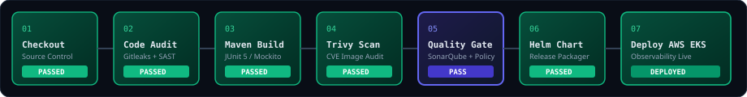

# Enterprise DevSecOps & Observability Platform

<div align="center">
  
</div>

<br/>

### 🔄 Automated DevSecOps Pipeline & GitOps Deployment
<div align="center">
  
</div>

<br/>

<div align="center">

[](https://openjdk.org/)
[](https://spring.io/projects/spring-boot)
[](https://github.com/aquasecurity/trivy)
[](https://github.com/gitleaks/gitleaks)
[](https://aws.amazon.com/eks/)
[](https://argo-cd.readthedocs.io/)
[](https://grafana.com)

</div>

---

## 📌 Executive Overview

The **Enterprise DevSecOps & Observability Platform** is a cloud-native banking microservices infrastructure engineered to solve **uncontrolled credential sprawl**, **container vulnerability debt**, and **distributed debugging latency** across mission-critical financial applications.

The platform integrates an end-to-end automated delivery lifecycle: **Jenkins CI** for building and shift-left security scanning (**SonarQube**, **Gitleaks**, **Trivy**), **Amazon ECR** for hardened artifact storage, **Argo CD** for declarative GitOps synchronization onto **Amazon EKS**, and a complete **LGTM & OpenTelemetry** enclave (Prometheus, Grafana, Fluent Bit, Elasticsearch/Loki, Tempo) for full distributed tracing and audit logging.

---

## ⚡ Core Engineering Problems Solved

* **Secret Sprawl & Token Exposure:** Hardcoded credentials or private keys in git commit history create critical security exposure. The pipeline integrates **Gitleaks** with `.gitleaks.toml` rules to automatically halt builds on exposed secrets.
* **Vulnerability Debt in Base Images:** Container layers frequently ship unpatched OS CVEs. **Trivy** scans image layers and dependency bills-of-materials (SBOM) against national CVE databases, blocking builds containing fixable `CRITICAL` or `HIGH` vulnerabilities.
* **Distributed Microservice Blind Spots:** Tracing failed financial transactions across multi-hop distributed services is traditionally complex. The platform injects uniform `X-Correlation-ID` headers paired with **OpenTelemetry**, exporting distributed traces to **Grafana Tempo** and JVM metrics to **Prometheus**.
* **PII & Financial Data Leaks in Logs:** Raw transaction requests risk leaking account numbers or customer identifiers into standard output. Custom Logback interceptors perform automated regex masking on credit card numbers, passwords, and sensitive identifiers before streaming logs to **Elasticsearch / Loki**.
* **Zero-Trust Network Isolation:** Flat pod networks expose backend persistence stores to arbitrary lateral traversal. Scoped Kubernetes **NetworkPolicies** and AWS Security Groups restrict MySQL (`:3306`) access exclusively to authorized backend transaction services.

---
```
## 📐 End-to-End System Architecture
[ External User / React 18 SPA ]
│
▼ HTTPS / TLS 1.3
[ AWS Load Balancer (ALB) ]
│
▼
[ Perimeter: Spring Cloud Gateway (:8085) ]
├── RS256 JWT Token Verification & Claims Extraction
├── In-Memory Redis Rate Limiting (Token Bucket)
├── X-Correlation-ID Propagation Filter
└── Sensitive PII Log Masking Interceptor
│
┌─────────┼──────────────────┬──────────────────┬──────────────────┐
▼         ▼                  ▼                  ▼                  ▼
[ Auth ] [ Customer ]       [ Account ]      [ Transaction ]    [ Notification ]
(:8081)   (:8086)            (:8082)            (:8083)            (:8084)
│         │                  │                  │                  │
│         └──────────────────┼──────────────────┘                  │
│                            ▼ Mutual JDBC (:3306)                 │
│                  [ MySQL 8.0 Cluster ]                           │
│              (Amazon EBS Persistent Volume)                      │
│                                                                  │
└────────────────────────────┬─────────────────────────────────────┘
▼ (Async Telemetry & OTel Spans)
[ Observability Enclave (EKS) ]
├── Metrics : Prometheus (:9090) ────> Grafana Dashboards (:3000)
├── Logs    : Fluent Bit DaemonSet ──> Elasticsearch / Loki (:3100)
├── Traces  : OpenTelemetry Agent ───> Grafana Tempo (:4317)
└── Alerts  : Alertmanager (:9093) ──> Webhook Notification Dispatch
```
---

## 🔄 Automated DevSecOps & GitOps Pipeline

Every commit executes across a standardized state machine:

1. **Source Checkout & Secret Audit:** Retrieves repository source code and triggers **Gitleaks** to verify zero exposed private keys, tokens, or configuration secrets.
2. **Static Application Security Testing (SAST):** Compiles application code and evaluates cyclomatic complexity, code smells, and CWE patterns against **SonarQube Quality Gates**.
3. **Container Compilation & Hardening:** Packages microservices into minimal multi-stage Docker images using non-root execution contexts.
4. **Trivy Container Vulnerability Scan:** Audits local container images layer-by-layer for known CVE vulnerabilities and dependency weaknesses.
5. **Image Registry Storage (Amazon ECR):** Authenticates and pushes version-tagged container images to Amazon Elastic Container Registry.
6. **GitOps Continuous Deployment (Argo CD):** Monitors Kubernetes manifest changes in Git and continuously reconciles the running cluster state on Amazon EKS.
7. **Telemetry Verification:** Confirms that Prometheus targets, Fluent Bit log forwarders, and OpenTelemetry trace spans are actively streaming for deployed pods.

---

## 🛡️ Microservices & Port Matrix

| Service | Port | Technology | Primary Functionality | Security Controls |
| :--- | :---: | :--- | :--- | :--- |
| **API Gateway** | `8085` | Spring Cloud Gateway | Edge ingress routing, rate limiting | JWT validation, Redis rate-limiter, CORS enforcement |
| **Auth Service** | `8081` | Spring Boot 3.x | Identity issuance & token lifecycle | BCrypt hashing, RS256 signed JWTs, refresh rotation |
| **Account Service** | `8082` | Spring Boot 3.x | Customer profile & ledger querying | RBAC method security, PII log sanitization |
| **Transaction Service** | `8083` | Spring Boot 3.x | Fund transfers & atomic ledgering | Idempotency locks, Atomic transactions, NetworkPolicy gate |
| **Notification Service** | `8084` | Spring Boot 3.x | Asynchronous security & audit alerts | Decoupled event consumer, internal-only ingress |
| **Customer Service** | `8086` | Spring Boot 3.x | User profile and onboarding data | Input validation schemas, encrypted storage |
| **MySQL Cluster** | `3306` | MySQL 8.0 StatefulSet | Core banking data persistence | Amazon EBS encrypted volumes, non-root user |
| **Redis Cache** | `6379` | Redis 7.x | Rate-limiting buckets, token denylists | In-memory token expiration, non-root container |

---

## 📊 Telemetry & Observability Stack

* **Metrics (Prometheus & Grafana):** Continuously scrapes JVM metrics, garbage collection timings, pod resource usage, and standard RED metrics (Rate, Errors, Duration).
* **Distributed Tracing (OpenTelemetry & Tempo):** Generates distributed trace graphs across inbound gateway requests, inter-service RestTemplate calls, and JDBC database queries.
* **Centralized Logging (Fluent Bit & Elasticsearch / Loki):** DaemonSet collectors ingest container logs, attach Kubernetes metadata labels, and stream them to centralized dashboards for real-time investigation.
* **Health & Probes:** Implements Spring Boot Actuator liveness and readiness endpoints (`/actuator/health`) across all pods for automated Kubernetes self-healing.

---

## 🚀 Quick Start (Local Docker Compose)

### Prerequisites
* **Java 21 JDK** & **Maven 3.9+**
* **Docker & Docker Compose v2+**
* **Node.js 18+**

### 1. Clone & Configure Environment
```bash
git clone [https://github.com/nikitamathe/enterprise-devsecops-observability-platform.git](https://github.com/nikitamathe/enterprise-devsecops-observability-platform.git)
cd enterprise-devsecops-observability-platform
cp .env.example .env
```
### 2. Launch Platform
```bash
# Starts MySQL, Redis, all Microservices, API Gateway, Frontend, and Observability stack
docker compose up --build -d
```
### 3. Verify Live Endpoints
Banking Web Portal: http://localhost:5173

API Gateway Health: http://localhost:8085/actuator/health

Grafana Dashboards: http://localhost:3000 (Default: admin / admin)

Prometheus Metrics: http://localhost:9090


